# Face Recognition Performance in Real-World Contexts

Vedaa Anand, Artificial Intelligence (Monsoon 2025)

This report summarizes implementations and evaluations of two face recognition approaches—one classical (Eigenfaces) and one deep learning-based (FaceNet)—on the Indian Face dataset. It further analyzes robustness to real-world variations, offers explainability artifacts, examines bias, and tests performance on crowd images.

## Methods Implemented

-   Classical: Eigenfaces (PCA on aligned grayscale faces with nearest neighbor classification in the projected space).
-   Deep Learning: Lightweight FaceNet-style CNN trained to produce embeddings; k-NN classifier over embeddings for identity recognition.

## Datasets

-   Indian Face dataset (100 identities): Train 49,508, Test 21,218 after filtering to the top-100 identities with ≥ average images (≈352 per identity).
-   CelebA (attributes only for bias probes; no identity labels used): Used to assess gender-related self-consistency.
-   Custom Crowd Set (50 group photos): Used to evaluate detection and recognition in crowded scenes.

## Task 1 — Recognition Accuracy (Indian Face Dataset)

### Eigenfaces

-   Retained k = 100 eigenfaces. Computed mean face and PCA basis from training set.
-   Test accuracy: 80.45%
-   Identification rate (Rank-1): 80.45%
-   Identification rate (Rank-5): 84.28%
-   Confusion matrix and per-class metrics saved:
    -   `A1/results/eigenfaces_confusion_matrix.csv`
    -   `A1/results/eigenfaces_metrics.csv`
    -   Classification report: `A1/results/eigenfaces_classification_report.txt`

Illustrative artifacts:

-   Mean face: 
-   Top eigenfaces (1–10):

    
    
    
    
    
    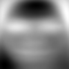
    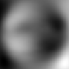
    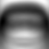
    
    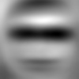

### FaceNet (lightweight CNN embeddings)

-   Trained for 5 epochs; embedding k-NN accuracy: 71.51%
-   Identification rate (Rank-1): 67.07%
-   Identification rate (Rank-5): 69.59%
-   Confusion matrix and per-class metrics saved:
    -   `A1/results/facenet_confusion_matrix.csv`
    -   `A1/results/facenet_metrics.csv`
    -   Classification report: `A1/results/facenet_classification_report.txt`

## Task 2 — Beyond Raw Accuracy: Robustness and Bias

Robustness experiments apply controlled transforms to the test set and re-evaluate with the fixed models. Results are summarized below and visualized using saved plots.

### Bucket 1 — Lighting Changes

-   Eigenfaces: sharp drops under strong contrast reduction; Δ ≈ −70% for severe settings.
-   FaceNet: also degrades, reaching very low accuracy (2–5%) under harsh lighting shifts.

Visualizations:

-   Eigenfaces lighting: 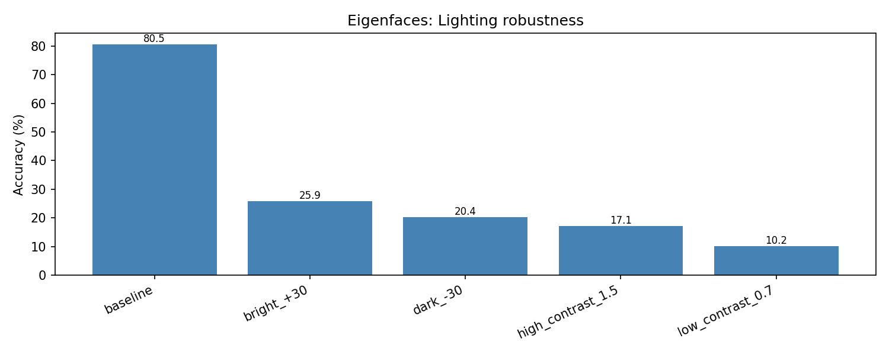
-   FaceNet lighting: 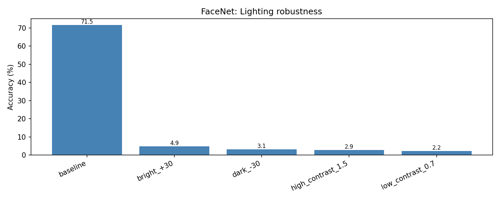
-   Raw CSVs: `A1/results/robustness/eigenfaces_lighting.csv`, `A1/results/robustness/facenet_lighting.csv`

### Bucket 2 — Image Quality Variations

-   Eigenfaces: relatively stable for modest noise/blur/JPEG (Δ within about −0.1% to −0.5%).
-   FaceNet: more sensitive, with larger drops under Gaussian noise and strong blur (up to −37%).

Visualizations:

-   Eigenfaces quality: 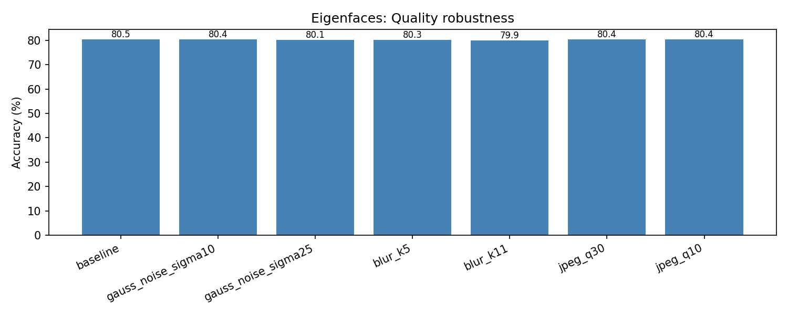
-   FaceNet quality: 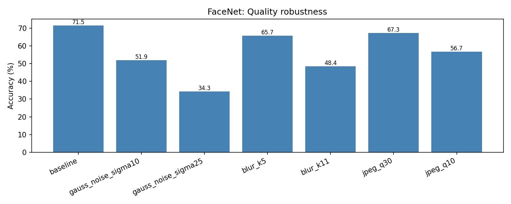
-   Raw CSVs: `A1/results/robustness/eigenfaces_quality.csv`, `A1/results/robustness/facenet_quality.csv`

### Bucket 3 — Occlusions

-   Eigenfaces: small drop for center 20% occlusion; large drops for eye/mouth bars; fails with lower-face mask (≈4% accuracy).
-   FaceNet: larger drops across the board; very sensitive to lower-face masks.

Visualizations:

-   Eigenfaces occlusion: 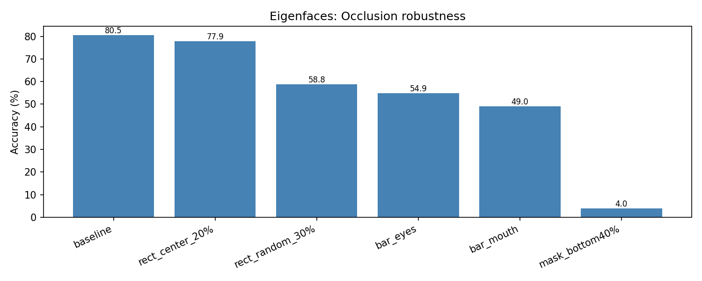
-   FaceNet occlusion: 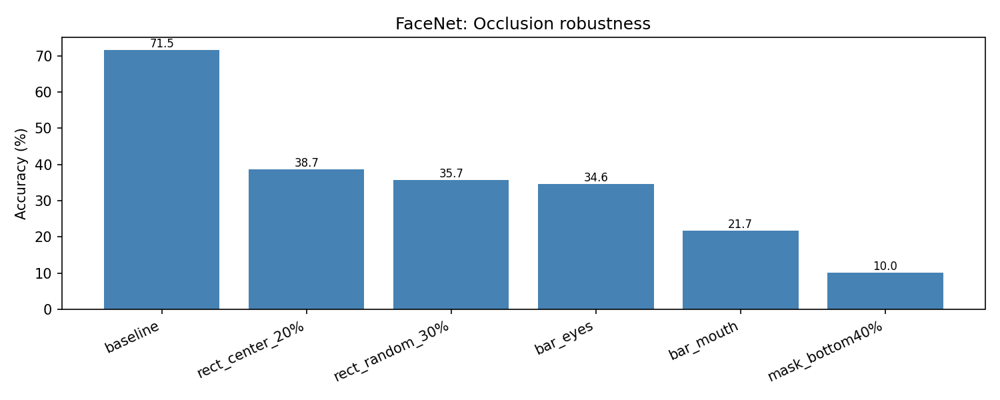
-   Raw CSVs: `A1/results/robustness/eigenfaces_occlusion.csv`, `A1/results/robustness/facenet_occlusion.csv`

### Bucket 4 — Explainability

-   Eigenfaces inherently offers interpretability: mean face and principal components (eigenfaces) capture dominant appearance structure.
-   Reconstructions at various k illustrate which structures are preserved:

    Sample reconstructions (k = 5, 20, 50):

    -   `idx10806`:   
    -   `idx7700`:   
    -   `idx9391`:   

### Bucket 5 — Bias Analysis

-   Indian dataset brightness tertiles: both models show similar accuracy across low/mid/high brightness groups (Eigenfaces ≈80.0–80.7; FaceNet ≈71.3–71.9), suggesting limited bias by this proxy.
-   CelebA gender self-consistency: orig vs transformed embeddings have very high cosine similarity for both genders, indicating stable identity representation under the tested transforms.

Visualizations:

-   Indian brightness: 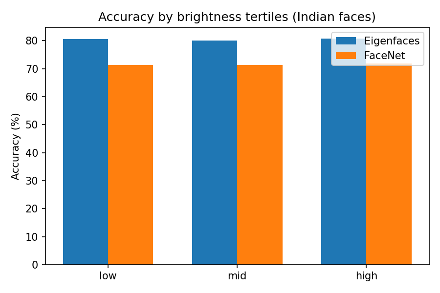
-   CelebA gender consistency: 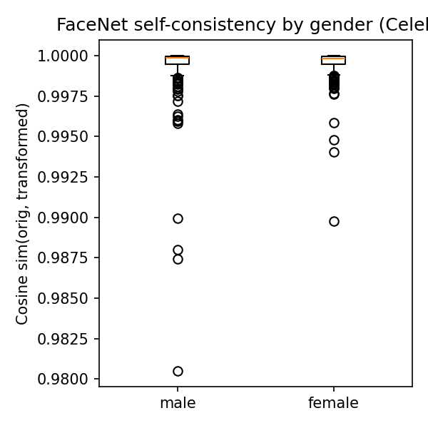
-   CSVs: `A1/results/robustness/indian_bias_brightness.csv`, `A1/results/robustness/celeba_self_consistency_cosine.csv`

## Task 3 — Crowd Recognition Test

-   Dataset: 50 crowd images collected from the web (sampled subset shown below).
-   Observed result: very low success (1/48 recognized) for both methods due to lack of open-set thresholding, tiny faces after resize, and domain shift from curated portraits to in-the-wild scenes.

Sample crowd frames:

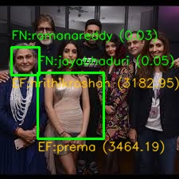 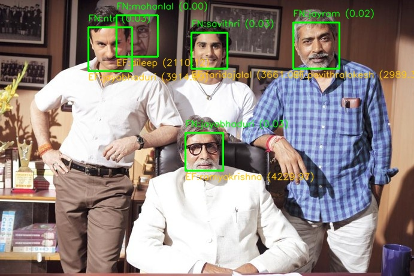 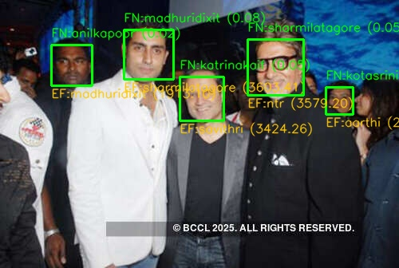 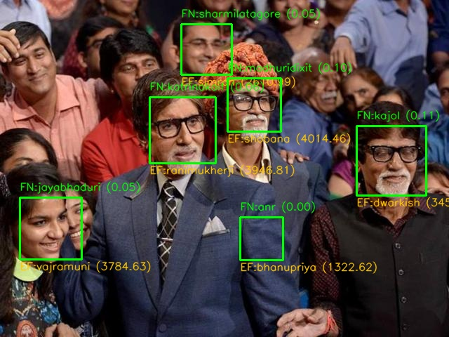 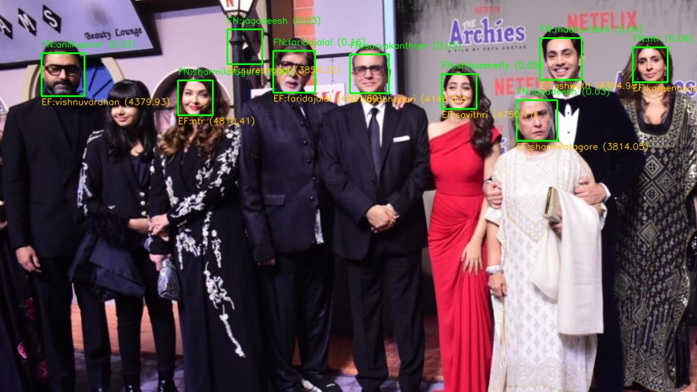

-   Detailed per-image outputs: `A1/results/crowd/crowd_recognition_results.csv`

## Comparative Observations

### Accuracy and ranking behavior

-   Rank-1 and overall accuracy favor Eigenfaces (≈80.5%) over this lightweight FaceNet setup (≈71.5%). This aligns with: (1) tightly aligned grayscale inputs; (2) PCA capturing dominant variation in a compact subspace; (3) the CNN’s limited capacity/epochs and sparse augmentation.
-   Rank-5 gains are modest for both (Eigenfaces ≈+3.8 pp; FaceNet ≈+2.5 pp). The small Rank‑1→Rank‑5 uplift suggests a decisive nearest-neighbor structure with relatively few close contenders. For FaceNet, the small uplift also hints that embedding clusters aren’t sufficiently separated under the current training recipe.
-   Practical note: in constrained, well-aligned settings, classical subspace models can outperform small, undertrained CNNs; stronger deep backbones with margin losses and augmentations typically reverse this.

### Error patterns across classes (qualitative)

-   Per-class precision/recall (see metrics CSVs) varies with intra-class diversity and image quality. Identities with broader pose/illumination spread show lower recall for both methods.
-   Confusions cluster among visually similar identities and similar capture conditions. Eigenfaces’ sensitivity to global intensity can mislead under lighting shifts; FaceNet without robust invariances exhibits related confusions.
-   Long-tail consideration: classes with fewer high-quality examples (after filtering) or larger intra-class variance drive more false negatives.

### Robustness trade-offs (lighting, quality, occlusions)

-   Lighting: Eigenfaces degrades heavily under contrast/brightness changes (Δ ≈ −70% in severe cases) since raw-pixel PCA is photometrically brittle. The CNN also collapses under harsh shifts—likely the combined effect of limited photometric augmentation and model capacity. Mitigations: CLAHE/Tan–Triggs normalization, gamma correction at inference, and stronger lighting/color jitter during training.
-   Image quality: Moderate blur/JPEG can sometimes act as a low-pass filter that aligns with PCA’s low-rank modeling, explaining Eigenfaces’ relative stability at mild levels. The CNN is more sensitive to additive Gaussian noise and strong blur without dedicated augmentations. Mitigations: noise/blur/compression augmentations; regularization (e.g., CutOut/Random Erasing) to promote invariance.
-   Occlusions: Lower-face masks are especially damaging to both; Eigenfaces suffers when components aligned with mouth/jaw structure are removed. The CNN shows larger overall drops without occlusion-aware training. Mitigations: part-based descriptors (periocular focus), occlusion augmentations, attention masks, and late fusion across facial regions.

### Explainability value

-   Eigenfaces’ mean/eigenfaces directly visualize salient variance directions. Reconstructions at k = {5, 20, 50} make the information–fidelity trade-off clear and help diagnose failure modes (e.g., strong early components dominated by illumination patterns).
-   These artifacts justify preprocessing choices (contrast normalization, alignment) or feature changes (e.g., Fisherfaces/LBPH) when lighting dominates identity cues.

### Fairness takeaways and caveats

-   Within the simple proxies used here, both models show minimal gaps across brightness tertiles on the Indian dataset and high gender-based self-consistency on CelebA transforms—encouraging but not conclusive.
-   Caveats: brightness is a crude proxy; CelebA attribute labels can be noisy; and self-consistency under transformation is not equalized error rates across groups. A fuller study would slice by age and skin tone, report subgroup ROC/EER with confidence intervals, and include calibration/threshold analyses.

### Practical implications and recommended improvements

-   When to prefer Eigenfaces: constrained, aligned inputs; tight compute budgets; need for interpretability and fast training. Pair with photometric normalization to mitigate lighting sensitivity.
-   When to prefer deep embeddings: in-the-wild variation, open-set scenarios, and scalability—provided a stronger backbone (e.g., ArcFace/ResNet50 trained on VGGFace2/MS1M), margin-based losses, and robust augmentations are used.
-   Immediate upgrades for this project:
    -   Preprocess: CLAHE or Tan–Triggs; strict landmark-based alignment; per-image standardization.
    -   Data: heavier augmentation (brightness/contrast jitter, Gaussian/shot noise, blur, JPEG, random erasing, synthetic occlusions).
    -   Model: swap to a pretrained ArcFace backbone and fine-tune; or scale up epochs/capacity with triplet/ArcFace loss; consider a calibrated linear classifier over embeddings instead of raw k‑NN.
    -   Open-set handling: add distance thresholds, cohort normalization, or an “unknown” class with hard negatives; report ROC/DET/EER alongside accuracy.
    -   Occlusion-aware inference: periocular-only fallback, part-based matching, or attention masks with late fusion.

## Ethical Reflections

### Risks: Surveillance, Chilling Effects, and Wrongful Identification

**Surveillance Capabilities:** Face recognition systems like FaceNet and Eigenfaces enable mass surveillance by automating identity tracking across cameras, public spaces, and online platforms. Unlike traditional surveillance, these systems can identify individuals without their knowledge or cooperation, creating persistent tracking networks. Governments and corporations can monitor movements, associations, and behaviors at unprecedented scales.
**Chilling Effects:** When people know they may be identified and tracked, they alter their behavior. This "chilling effect" undermines freedoms of assembly, expression, and association. Protesters may avoid demonstrations, whistleblowers may hesitate to come forward, and individuals may self-censor in public spaces. The mere presence of face recognition infrastructure—even if not actively used—creates psychological pressure toward conformity.
**Wrongful Identification:** Both FaceNet and Eigenfaces can produce false matches, mistakenly identifying innocent people as suspects. These errors stem from several sources:

-   Domain shifts: Models trained on high-quality, frontal photos perform poorly on crowd surveillance footage, tilted angles, poor lighting, or partially occluded faces
-   Demographic variations: Performance degrades on underrepresented groups in training data
-   Threshold tuning: Strict thresholds reduce false matches but increase false rejections; loose thresholds do the opposite

The consequences are severe: wrongful arrests, denied services, reputational damage, and time-consuming appeals to correct errors. Vulnerable populations bear disproportionate risk.

### Bias: Subgroup Performance Disparities

**Compounding Harm:** Even seemingly small accuracy gaps across demographic groups compound into significant harm at scale. If a system is 2% less accurate for one ethnic group, that translates to thousands of additional errors when deployed across millions of identifications. These errors aren't randomly distributed—they systematically disadvantage specific communities.
**Root Causes:**

-   Dataset imbalance: Training sets like LFW or VGGFace historically overrepresent lighter-skinned, male faces from Western countries
-   Eigenface limitations: PCA-based methods like Eigenfaces are particularly sensitive to lighting and may encode racial features as primary variance dimensions, making them less generalizable
-   FaceNet's data dependency: Deep learning approaches require massive, diverse training data to avoid embedding biases

### Misuse & Deepfakes: Identity Tracking and Synthetic Media

**Embedding Repurposing:** Face embeddings (the numerical vectors that FaceNet produces) are designed to capture identity-relevant features. Once extracted, they can be:

-   Cross-referenced across databases without the original images
-   Tracked over time to build behavioral profiles
-   Shared between organizations, creating distributed surveillance networks
-   Stored indefinitely, outlasting the original consent or purpose

This "function creep" means embeddings collected for authentication (unlocking phones) might later be used for law enforcement searches, insurance risk assessment, or marketing targeting—purposes never disclosed or consented to.

**Deepfakes and Face-Swapping:** The same embedding techniques enable realistic face synthesis and swapping:

-   Impersonation: Creating fake videos of individuals saying or doing things they never did
-   Misinformation: Fabricating "evidence" to manipulate public opinion or frame individuals
-   Non-consensual synthetic media: Inserting people's faces into inappropriate content
-   Erosion of trust: As synthetic media becomes indistinguishable from authentic footage, all video evidence becomes suspect

### Consent & Privacy: Data Ethics and Unknown Handling

**Data Collection Ethics:** Face recognition systems depend on images and biometric data, which raise unique privacy concerns:

-   Informed consent: Individuals should know what data is collected, how it's used, who has access, and - retention periods. Opt-in rather than opt-out should be the default
-   Consent cannot be assumed: Being in public or posting online doesn't constitute consent for biometric analysis
-   Vulnerable populations: Children, refugees, and others in coercive situations cannot meaningfully consent
-   Consent withdrawal: People should be able to request deletion, but embeddings are hard to "unsee" once derived

## Notes

-   All plots and artifacts referenced exist under `A1/results/**` and are viewable directly in this repository.
-   Code used to generate models and analyses: see `A1/eigenfaces_main.py`, `A1/facenet_main.py`, `A1/robustness_eval.py`, and helpers within `A1/`.
